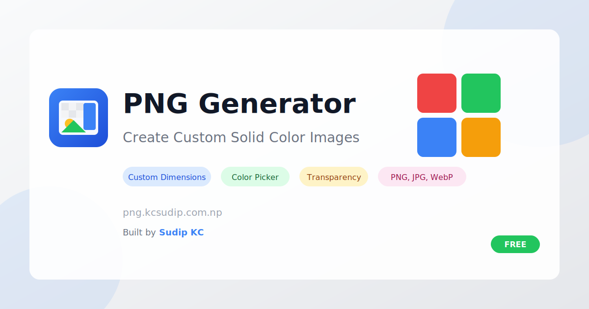

# PNG Generator

<div align="center">



**Create custom solid-color PNG images with ease**

[](https://png.kcsudip.com.np)
[](LICENSE)
[](https://react.dev)
[](https://tailwindcss.com)

[Live Demo](https://png.kcsudip.com.np) · [Report Bug](https://github.com/sudipkc3/png-creator/issues) · [Request Feature](https://github.com/sudipkc3/png-creator/issues)

</div>

---

## About

PNG Generator is a free, open-source web application that allows users to create customizable solid-color PNG images. Perfect for designers, developers, and content creators who need placeholder images, colored backgrounds, or template assets.

### Built With

- [React](https://react.dev) - UI Framework
- [Vite](https://vitejs.dev) - Build Tool
- [Tailwind CSS](https://tailwindcss.com) - Styling
- [Lucide React](https://lucide.dev) - Icons
- [FileSaver.js](https://github.com/eligrey/FileSaver.js) - File Downloads
- [React Hot Toast](https://react-hot-toast.com) - Notifications

---

## Features

### Core Features
- **Custom Dimensions** - Set any width and height (1px to 8192px)
- **Color Picker** - Hex input with native color picker support
- **Transparency Control** - Adjust opacity from 0% to 100%
- **Real-time Preview** - See changes instantly
- **Multiple Formats** - Download as PNG, JPG, or WebP

### Advanced Features
- **Size Presets** - Quick access to common dimensions:
  - Social Media (Instagram, Facebook, Twitter, LinkedIn, YouTube, Pinterest)
  - Devices (iPhone, iPad, MacBook, Desktop HD/4K/2K)
  - Common sizes (Squares, Banners, Favicon, App Icon, OG Image)
  - Documents (A4, Letter at 72dpi and 300dpi)
- **Aspect Ratio Lock** - Maintain proportions when resizing
- **Swap Dimensions** - Quickly switch width and height
- **Recent Colors** - Access your recently used colors
- **Copy to Clipboard** - Copy image directly or as Base64
- **Quality Settings** - Adjust quality for JPG/WebP formats

---

## Screenshots

<div align="center">
<table>
<tr>
<td width="50%">

**Main Interface**


</td>
<td width="50%">

**Color Picker**
- Hex color input
- Native color picker
- Preset colors
- Recent colors history

</td>
</tr>
</table>
</div>

---

## Getting Started

### Prerequisites

- Node.js 18+
- npm or yarn

### Installation

1. **Clone the repository**
   ```bash
   git clone https://github.com/sudipkc3/png-creator.git
   cd png-creator
   ```

2. **Install dependencies**
   ```bash
   npm install
   ```

3. **Start development server**
   ```bash
   npm run dev
   ```

4. **Open in browser**
   ```
   http://localhost:5173
   ```

### Build for Production

```bash
npm run build
```

The built files will be in the `dist/` directory.

---

## Project Structure

```
png-creator/
├── public/
│   ├── favicon.svg          # App favicon
│   ├── og-image.svg          # Social media preview
│   ├── manifest.json         # PWA manifest
│   ├── robots.txt            # SEO robots file
│   ├── sitemap.xml           # SEO sitemap
│   └── ...                   # Other static assets
├── src/
│   ├── components/
│   │   ├── CanvasPreview.jsx # Image preview component
│   │   ├── ColorPicker.jsx   # Color selection component
│   │   ├── DimensionInput.jsx# Size controls component
│   │   └── DownloadButton.jsx# Export controls component
│   ├── utils/
│   │   ├── colorUtils.js     # Color conversion utilities
│   │   └── presets.js        # Size preset definitions
│   ├── App.jsx               # Main application
│   ├── main.jsx              # Entry point
│   └── index.css             # Global styles
├── index.html                # HTML template with SEO
├── vite.config.js            # Vite configuration
├── package.json              # Dependencies
└── README.md                 # This file
```

---

## Usage

### Basic Usage

1. **Set Dimensions** - Enter width and height or choose a preset
2. **Pick a Color** - Use the color picker or enter a hex code
3. **Adjust Opacity** - Slide to set transparency level
4. **Download** - Click download to save your image

### Keyboard Shortcuts

| Action | Shortcut |
|--------|----------|
| Focus width input | `Tab` |
| Focus height input | `Tab` |
| Navigate presets | `Arrow keys` |

### Tips

- Use **aspect ratio lock** when you want to maintain proportions
- **Recent colors** are saved locally for quick access
- **Copy to clipboard** works great for quick pastes into design tools
- **Base64 export** is useful for inline images in CSS/HTML

---

## API / Programmatic Usage

The canvas component exposes methods for programmatic image generation:

```javascript
// Get canvas reference
const canvasRef = useRef(null);

// Generate data URL
const dataUrl = canvasRef.current.toDataURL('image/png', 1);

// Generate blob
const blob = await canvasRef.current.toBlob('image/png', 1);
```

---

## SEO & Performance

This project includes comprehensive SEO optimization:

- **Meta Tags** - Title, description, keywords, author
- **Open Graph** - Facebook/LinkedIn preview cards
- **Twitter Cards** - Twitter preview support
- **Structured Data** - JSON-LD schema for search engines
- **PWA Support** - Installable as a progressive web app
- **Sitemap & Robots** - Search engine crawling support

---

## Contributing

Contributions are welcome! Here's how you can help:

1. **Fork the repository**
2. **Create a feature branch**
   ```bash
   git checkout -b feature/amazing-feature
   ```
3. **Commit your changes**
   ```bash
   git commit -m 'Add amazing feature'
   ```
4. **Push to the branch**
   ```bash
   git push origin feature/amazing-feature
   ```
5. **Open a Pull Request**

### Ideas for Contributions

- [ ] Gradient backgrounds
- [ ] Pattern/texture library
- [ ] Batch image generation
- [ ] Image history/undo
- [ ] Custom preset saving
- [ ] Browser extension

---

## License

This project is licensed under the MIT License - see the [LICENSE](LICENSE) file for details.

---

## Author

<div align="center">

**Sudip KC**

Fullstack Developer & UI/UX Designer from Pokhara, Nepal

[](https://kcsudip.com.np)
[](https://github.com/sudipkc3)
[](https://www.linkedin.com/in/kcsudip3/)
[](https://x.com/sudipkc0)
[](https://www.instagram.com/kcsudip3/)

</div>

---

## Other Projects

- [Tonalist](https://tonalist.kcsudip.com.np) - Color palette generator with WCAG compliance
- [BuilderDocs](https://builderdocs.kcsudip.com.np) - Documentation builder tool

---

<div align="center">

**If you find this project useful, please consider giving it a star!**

</div>
